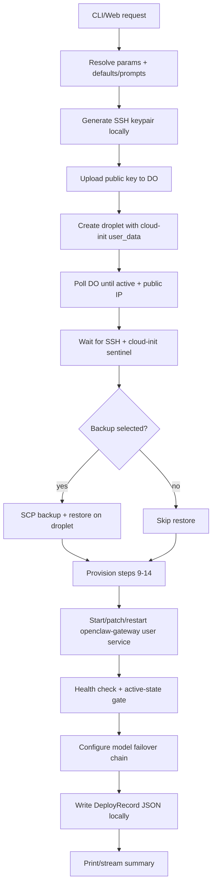
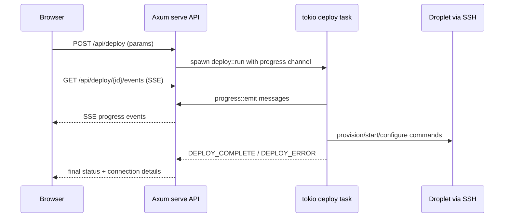

# ClawMacDo Codebase Logic and Data Flow

## 1. Purpose
`clawmacdo` is a Rust CLI (plus a local web UI) for:
- backing up local OpenClaw state,
- provisioning a new DigitalOcean droplet,
- installing and configuring OpenClaw and companion CLIs,
- restoring state from backup,
- operating lifecycle tasks (status, destroy),
- repairing WhatsApp channel support post-deploy.

Core entrypoint: [`src/main.rs`](/Users/kennethphang/Projects/clawmacdo/src/main.rs)

## 2. High-Level Architecture

### Layers
1. CLI/Web command orchestration (`src/commands/*`)
2. Infrastructure APIs (DigitalOcean + SSH)
3. Provisioning steps (`src/provision/*`)
4. Shared config/state (`src/config.rs`, deploy records)
5. UI/progress surfaces (`src/ui.rs`, `src/commands/serve.rs`, SSE)

### Main components
- `DoClient` ([`src/digitalocean.rs`](/Users/kennethphang/Projects/clawmacdo/src/digitalocean.rs)): manages DO API calls.
- SSH utilities ([`src/ssh.rs`](/Users/kennethphang/Projects/clawmacdo/src/ssh.rs)): key generation, remote command execution, SCP, readiness waits.
- Provision pipeline ([`src/provision/mod.rs`](/Users/kennethphang/Projects/clawmacdo/src/provision/mod.rs)): steps 9-14 in deploy.
- Deploy orchestrator ([`src/commands/deploy.rs`](/Users/kennethphang/Projects/clawmacdo/src/commands/deploy.rs)): full 16-step flow.
- Web server ([`src/commands/serve.rs`](/Users/kennethphang/Projects/clawmacdo/src/commands/serve.rs)): Axum UI + APIs + deploy SSE stream.

## 3. Command Logic Map

### `backup`
File: [`src/commands/backup.rs`](/Users/kennethphang/Projects/clawmacdo/src/commands/backup.rs)
- Ensures `~/.clawmacdo` dirs exist.
- Archives local `~/.openclaw/` and (if present) macOS LaunchAgent plist.
- Writes `~/.clawmacdo/backups/openclaw_backup_<timestamp>.tar.gz`.

### `deploy`
File: [`src/commands/deploy.rs`](/Users/kennethphang/Projects/clawmacdo/src/commands/deploy.rs)
- End-to-end 16-step provisioning with rollback-safe diagnostics.
- Uses:
  - DO API for droplet and SSH key lifecycle,
  - SSH/SCP for remote setup,
  - provisioning modules for host hardening + OpenClaw install,
  - remote service setup for gateway startup,
  - deploy record persistence.

### `migrate`
File: [`src/commands/migrate.rs`](/Users/kennethphang/Projects/clawmacdo/src/commands/migrate.rs)
- SSH into source droplet.
- Create remote backup tarball.
- Download backup locally.
- Reuse `deploy::run(...)` with downloaded backup.

### `status`
File: [`src/commands/status.rs`](/Users/kennethphang/Projects/clawmacdo/src/commands/status.rs)
- Lists DO droplets tagged `openclaw` with IP/region/status.

### `destroy`
File: [`src/commands/destroy.rs`](/Users/kennethphang/Projects/clawmacdo/src/commands/destroy.rs)
- Confirms and deletes selected `openclaw` droplet.
- Removes matching DO account SSH key and local key file when found.

### `list-backups`
File: [`src/commands/list_backups.rs`](/Users/kennethphang/Projects/clawmacdo/src/commands/list_backups.rs)
- Enumerates local `.tar.gz` backups with size/date.

### `serve` (local web UI)
File: [`src/commands/serve.rs`](/Users/kennethphang/Projects/clawmacdo/src/commands/serve.rs)
- Serves HTML UI + APIs:
  - `POST /api/deploy` starts async deploy job
  - `GET /api/deploy/{id}/events` streams progress (SSE)
  - `POST /api/telegram/pairing/approve`
  - `POST /api/whatsapp/repair`
  - `POST /api/whatsapp/qr`
- Uses in-memory job map: deploy ID -> status + receiver.

### `whatsapp-repair`
File: [`src/commands/whatsapp.rs`](/Users/kennethphang/Projects/clawmacdo/src/commands/whatsapp.rs)
- Remote post-deploy remediation:
  - updates OpenClaw,
  - enables WhatsApp plugin,
  - normalizes channel group policy for empty allowlists,
  - refreshes bundled extensions,
  - restarts gateway,
  - probes WhatsApp channel login capability.

## 4. Deploy Data Flow (Primary Path)

## 5. Provisioning Subflow (Steps 9-14)
File: [`src/provision/mod.rs`](/Users/kennethphang/Projects/clawmacdo/src/provision/mod.rs)

1. `user::provision` ([`src/provision/user.rs`](/Users/kennethphang/Projects/clawmacdo/src/provision/user.rs))
- Creates `openclaw` system user/home/shell.
- Installs shell env, sudoers scope, SSH authorized key.
- Enables lingering + user systemd manager.
- Moves restored backup from `/root/.openclaw` -> `/home/openclaw/.openclaw`.

2. `firewall::provision` ([`src/provision/firewall.rs`](/Users/kennethphang/Projects/clawmacdo/src/provision/firewall.rs))
- Configures fail2ban/unattended-upgrades.
- Hardens UFW and adds DOCKER-USER isolation rules.

3. `docker::provision` ([`src/provision/docker.rs`](/Users/kennethphang/Projects/clawmacdo/src/provision/docker.rs))
- Writes `/etc/docker/daemon.json`.
- Adds `openclaw` to `docker` group.
- Restarts Docker.

4. `nodejs::provision` ([`src/provision/nodejs.rs`](/Users/kennethphang/Projects/clawmacdo/src/provision/nodejs.rs))
- Configures pnpm global dirs.
- Installs Claude/Codex/Gemini CLIs.
- Verifies and symlinks binaries.

5. `openclaw::provision` ([`src/provision/openclaw.rs`](/Users/kennethphang/Projects/clawmacdo/src/provision/openclaw.rs))
- Creates `.openclaw` dirs and `.env` with API/messaging config.
- Installs OpenClaw globally and verifies version.
- Normalizes extension hardlinks.

6. Optional `tailscale::provision` ([`src/provision/tailscale.rs`](/Users/kennethphang/Projects/clawmacdo/src/provision/tailscale.rs))
- Installs Tailscale repo/package/service.
- Optionally runs `tailscale up` using auth key.

## 6. State and Persistence

### Local machine (`~/.clawmacdo`)
- `backups/`: local backup tarballs.
- `keys/`: generated deploy SSH private keys.
- `deploys/`: deploy record JSONs (`DeployRecord`).

### DeployRecord model
File: [`src/config.rs`](/Users/kennethphang/Projects/clawmacdo/src/config.rs)
- `id`, `droplet_id`, `hostname`, `ip_address`, region/size, SSH key path/fingerprint, backup restored, timestamp.

### Remote droplet
- `/home/openclaw/.openclaw/.env` for API + messaging env vars.
- `/home/openclaw/.config/systemd/user/openclaw-gateway.service` for gateway service.
- `/home/openclaw/.openclaw/openclaw.json` runtime config (channels/models/plugins).

## 7. Web UI Runtime Flow

## 8. Error Handling and Recovery Strategy
- Typed app errors in [`src/error.rs`](/Users/kennethphang/Projects/clawmacdo/src/error.rs).
- Deploy post-creation failures do **not** auto-destroy droplets; they print actionable SSH debug info.
- SSH/cloud-init waits include timeout + diagnostic output.
- Gateway start validation checks both `systemctl is-active` and `/health` probe.
- Web deploy path streams progress incrementally and reports explicit terminal markers (`DEPLOY_COMPLETE`, `DEPLOY_ERROR`).

## 9. External Dependencies / Integrations
- DigitalOcean REST API (`reqwest`).
- SSH/SCP (`ssh2` + `libssh2`).
- Droplet OS services: `cloud-init`, `systemd --user`, `docker`, `ufw`, `fail2ban`, optional `tailscale`.
- OpenClaw CLI + runtime for channel operations and gateway management.

## 10. End-to-End Data Lifecycle (Concise)
1. Input parameters come from CLI flags/env or web JSON payload.
2. Parameters become `DeployParams`/`MigrateParams` structs.
3. Provisioning transforms inputs into remote state (`.env`, configs, services, plugins).
4. Operational output (IP/key/hostname/IDs) is persisted as `DeployRecord` JSON.
5. Runtime operations (pairing, QR, repair) use stored IP/key path + SSH command execution.

