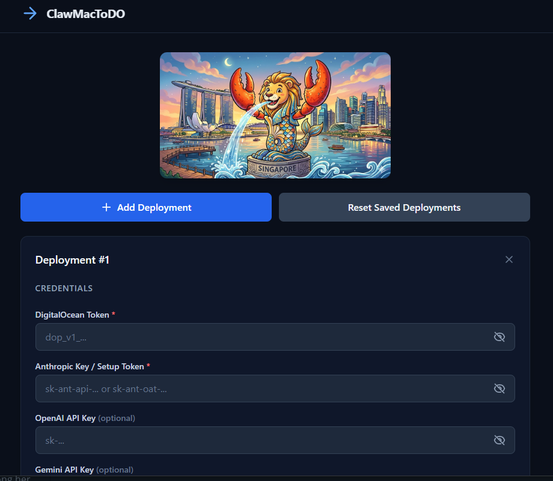

# clawmacdo

[](https://github.com/kenken64/clawmacdo/actions/workflows/release.yml)
[](https://github.com/kenken64/clawmacdo/actions/workflows/changelog.yml)

Rust CLI tool for migrating [OpenClaw](https://openclaw.ai) from Mac or an existing DigitalOcean droplet to a new DigitalOcean droplet — with Claude Code, Codex, and Gemini CLI pre-installed.

## Features

- **Backup** local `~/.openclaw/` config into a timestamped `.tar.gz`
- **1-click deploy**: generate SSH keys, provision a DO droplet, install Node 24 + OpenClaw + Claude Code + Codex + Gemini CLI, restore config, configure `.env` (API + messaging), start the gateway, and auto-configure model failover
- **DO-to-DO migration**: SSH into a source droplet, back up remotely, deploy to a new droplet, restore
- **Destroy**: delete a droplet by name with confirmation, clean up SSH keys (DO + local)
- **Status**: list all `openclaw`-tagged droplets with IPs
- **List backups**: show local backup archives with sizes and dates

## Download

Pre-built binaries for every release are available on the [Releases page](https://github.com/kenken64/clawmacdo/releases):

| Platform | Architecture | File |
|----------|-------------|------|
| Windows  | x86_64      | `clawmacdo-windows-amd64.zip` |
| Linux    | x86_64      | `clawmacdo-linux-amd64.tar.gz` |
| macOS    | Apple Silicon (arm64) | `clawmacdo-darwin-arm64.tar.gz` |

## Installation

### From release binary

Download the archive for your platform from [Releases](https://github.com/kenken64/clawmacdo/releases), extract, and add to your `PATH`.

### From source

```bash
cargo build --release
```

The binary will be at `target/release/clawmacdo.exe` (Windows) or `target/release/clawmacdo` (Linux/macOS).

#### Build prerequisites

- Rust toolchain (stable)
- On Windows: MSVC build tools + Windows SDK (for `libssh2` native compilation)
- On Linux: `libssl-dev`, `pkg-config`

## Usage

```
clawmacdo <COMMAND>

Commands:
  backup        Archive ~/.openclaw/ and LaunchAgent plist into a .tar.gz
  deploy        Full 1-click deploy to DigitalOcean
  destroy       Destroy a droplet by name and clean up SSH keys
  migrate       DO → DO migration: backup source, deploy new, restore
  status        List deployed openclaw-tagged droplets
  list-backups  Show local backup archives
  serve         Start the local web UI
  whatsapp-repair  Repair WhatsApp channel support on an existing droplet
  docker-fix    Repair agent Docker access on an existing droplet
  help          Print help
```

### Web UI (required for browser deploy flow)

Run `serve` before opening the browser UI:

```bash
clawmacdo serve
```

Then open `http://127.0.0.1:3456/` and keep the serve process running while you deploy.



### Backup

```bash
clawmacdo backup
```

Creates `~/.clawmacdo/backups/openclaw_backup_<timestamp>.tar.gz`.

### Deploy

```bash
clawmacdo deploy \
  --do-token=dop_v1_xxx \
  --anthropic-key=sk-ant-api-xxx \
  --openai-key=sk-xxx \
  --gemini-key=AIzaSy... \
  --whatsapp-phone-number=15551234567 \
  --telegram-bot-token=123456789:AA...
```

Optional flags: `--region` (default: `sgp1`), `--size` (default: `s-2vcpu-4gb`), `--hostname`, `--backup <path>`, `--enable-backups`, `--tailscale`, `--tailscale-auth-key`, `--enable-sandbox`.

Missing values trigger interactive prompts.

#### Deploy flow (16 steps)

```
  1. Resolve parameters (interactive prompts for missing values)
  2. Generate SSH key pair → ~/.clawmacdo/keys/
  3. Upload public key to DigitalOcean
  4. Create droplet with cloud-init (tagged "openclaw")
  5. Poll until droplet is active
  6. Wait for SSH to accept connections
  7. Wait for cloud-init to complete
  8. SCP backup archive to server (if selected)
  9. Create `openclaw` user + SSH access
 10. Harden firewall (UFW + fail2ban + Docker isolation rules)
 11. Configure Docker daemon
 12. Set up Node.js/pnpm and install AI CLIs
 13. Install OpenClaw + write `.env`
 14. Optional Tailscale install (`--tailscale`) + auto-connect when `--tailscale-auth-key` is provided
 15. Start OpenClaw gateway and apply model/sandbox config
 16. Save deploy record and print summary
```

### Migrate (DO to DO)

```bash
clawmacdo migrate \
  --do-token=dop_v1_xxx \
  --anthropic-key=sk-ant-api-xxx \
  --openai-key=sk-xxx \
  --whatsapp-phone-number=15551234567 \
  --telegram-bot-token=123456789:AA... \
  --source-ip=164.90.x.x \
  --source-key=~/.ssh/id_ed25519
```

Connects to the source droplet, creates a remote backup, downloads it locally, then runs the full deploy flow on a new droplet with the backup auto-selected.

### Resulting .env on server

After deploy/migrate, credentials and messaging settings are written to:

`/home/openclaw/.openclaw/.env`

```bash
ANTHROPIC_API_KEY=...
ANTHROPIC_SETUP_TOKEN=...
OPENAI_API_KEY=...
GEMINI_API_KEY=...
WHATSAPP_PHONE_NUMBER=...
TELEGRAM_BOT_TOKEN=...
```

### Automatic model failover configuration

After the gateway is started, deploy/migrate automatically configures model routing:

- Primary model: `anthropic/claude-opus-4-6`
- Adds fallback: `openai/gpt-5-mini` when `OPENAI_API_KEY` is provided
- Adds fallback: `google/gemini-2.5-flash` when `GEMINI_API_KEY` is provided

### Destroy

```bash
clawmacdo destroy \
  --do-token=dop_v1_xxx \
  --name=openclaw-8d533bfd
```

Finds the named droplet among `openclaw`-tagged droplets, shows its details (name, IP, region), and asks for confirmation before destroying. Also cleans up:

- The associated SSH key from your DigitalOcean account (`clawmacdo-<hostname_suffix>`)
- The local key file from `~/.clawmacdo/keys/`

### Status

```bash
clawmacdo status --do-token=dop_v1_xxx
```

### List Backups

```bash
clawmacdo list-backups
```

### WhatsApp Repair (post-deploy)

Use this when `openclaw channels login --channel whatsapp` reports `Unsupported channel: whatsapp`.

```bash
clawmacdo whatsapp-repair \
  --ip=152.42.247.145 \
  --ssh-key-path=/Users/you/.clawmacdo/keys/clawmacdo_xxx
```

This updates OpenClaw, refreshes bundled extensions, restarts the gateway, and probes WhatsApp channel availability.

### Docker Access Repair (post-deploy)

Use this when bot replies fail with Docker socket permission errors (e.g. `/var/run/docker.sock: permission denied`).

```bash
clawmacdo docker-fix \
  --ip=152.42.247.145 \
  --ssh-key-path=/Users/you/.clawmacdo/keys/clawmacdo_xxx
```

This reapplies gateway service Docker group wrapping, restarts the gateway, and validates Docker access + gateway status.

## What gets installed on the droplet

1. System packages: `curl`, `gnupg`, `ufw`, `git`, `build-essential`, `docker.io`, `fail2ban`, `unattended-upgrades`
2. Firewall hardening: UFW baseline + Docker isolation (`DOCKER-USER`) + fail2ban
3. Docker daemon configuration (`/etc/docker/daemon.json`)
4. Node.js 24 LTS via NodeSource + pnpm setup
5. OpenClaw gateway (user-level systemd service)
6. Claude Code CLI (`@anthropic-ai/claude-code`)
7. Codex CLI (`@openai/codex`)
8. Gemini CLI (`@google/gemini-cli`)
9. API keys and messaging config written to `/home/openclaw/.openclaw/.env` (Anthropic, OpenAI, Gemini, WhatsApp phone number, Telegram bot token)
10. Optional Tailscale VPN (`--tailscale`) with optional auto-connect (`--tailscale-auth-key`)
11. Optional OpenClaw sandbox config (`--enable-sandbox`)

### Self-healing & resilience

Every deployed droplet includes automatic recovery mechanisms:

| Feature | Description |
|---------|-------------|
| **loginctl linger** | Enabled for root — gateway survives SSH disconnects |
| **Health-check script** | `/root/.openclaw/workspace/openclaw-healthcheck.sh` — checks gateway process + RPC probe |
| **Cron: health-check** | Runs every 5 minutes (`*/5 * * * *`), auto-restarts gateway on failure |
| **Cron: log rotation** | Truncates health-check log daily at midnight to prevent disk fill |
| **Double-check restart** | Health-check retries after 15s before restarting to avoid false positives |

> **Note:** OpenClaw's installer creates its own user-level systemd service at `~/.config/systemd/user/openclaw-gateway.service`. The cloud-init script does not create a competing systemd unit — it only prepares the environment and resilience tooling.

### Anthropic credential routing

The `--anthropic-key` field accepts both API keys and setup tokens:

| Key prefix | Type | Action |
|-----------|------|--------|
| `sk-ant-api-...` | Real API key | ✅ Written to `.env` |
| `sk-ant-oat-...` | OAuth setup token | ✅ Stored as `ANTHROPIC_SETUP_TOKEN` + setup-token auth command is attempted |
| _(empty)_ | Not provided | ⚠️ Skipped |

`ANTHROPIC_API_KEY` and `ANTHROPIC_SETUP_TOKEN` are kept separate so OAuth-style tokens are not injected where an API key is expected.

On deploy start, clawmacdo attempts `openclaw models auth setup-token` when a setup token is provided.

## Environment variables

Credentials and messaging settings can be passed as flags or environment variables:

| Flag | Env var | Required |
|---|---|---|
| `--do-token` | `DO_TOKEN` | ✅ Yes |
| `--anthropic-key` | `ANTHROPIC_API_KEY` | ✅ Yes |
| `--openai-key` | `OPENAI_API_KEY` | Optional |
| `--gemini-key` | `GEMINI_API_KEY` | Optional |
| `--whatsapp-phone-number` | `WHATSAPP_PHONE_NUMBER` | Optional |
| `--telegram-bot-token` | `TELEGRAM_BOT_TOKEN` | Optional |
| `--tailscale-auth-key` | `TAILSCALE_AUTH_KEY` | Optional (used with `--tailscale`) |

## Data directories

| Path | Purpose |
|---|---|
| `~/.clawmacdo/backups/` | Backup archives |
| `~/.clawmacdo/keys/` | Generated SSH key pairs |
| `~/.clawmacdo/deploys/` | Deploy record JSON files |

## Project structure

```
src/
├── main.rs              # Clap CLI entry point
├── commands/
│   ├── mod.rs
│   ├── backup.rs        # Scan + tar.gz ~/.openclaw/
│   ├── deploy.rs        # 16-step deploy orchestrator
│   ├── migrate.rs       # DO→DO: remote backup + deploy
│   ├── destroy.rs       # Destroy droplet + clean up SSH keys
│   ├── status.rs        # DO API → list tagged droplets
│   ├── list_backups.rs  # List local backup files
│   ├── whatsapp.rs      # Post-deploy WhatsApp support repair
│   └── docker_fix.rs    # Post-deploy Docker access repair
├── config.rs            # App paths, constants, DeployRecord
├── digitalocean.rs      # DO API client
├── ssh.rs               # Ed25519 keygen, SSH exec, SCP
├── cloud_init.rs        # Cloud-init YAML template (includes healthcheck + linger)
├── ui.rs                # Interactive prompts, spinners, summary
└── error.rs             # Typed errors (thiserror)
```

## License

MIT
